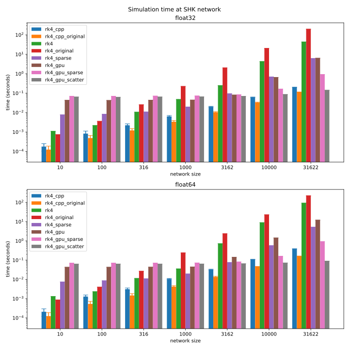

# Swing Equation

### Solve swing equation at given network
$$ m_i \frac{d^2 \theta_i}{dt^2} = P_i - \gamma_i \frac{d \theta_i}{dt} + \sum_j K_{ij}  \sin(\theta_j-\theta_i) $$
- $P_i$: power of node $i$
- $\gamma_i$: damping of node $i$
- $m_i$: mass of node $i$
- $\theta_i$: state of node $i$
- $K$ : Adjacency matrix, weighted by coupling constant $K_{ij}$

### Available options for `swing_solver.solve`
- Can perform 1st, 2nd, 4th order Runge-Kutta methods
- Support both float32(float), float64(double) precision
- `default`: Compiled with **jit**. Utilize $\sum_j K_{ij} \sin(\theta_j-\theta_i) = \cos(\theta_i) [K \sin(\theta)]_i - \sin(\theta_i) [K \cos(\theta)]_i$
- `original`: Compiled with **jit**. UNaive implementation of swing equation with adjacency matrix
- `cpp`: similar to `default.py` written in c++.
- `cpp_original`: similar to `original.py` written in c++.
- `sparse`: Use sparse matrix representation on `default.py`
- `gpu`: Use GPU on `default.py` by **pytorch**
- `gpu_sparse`: Use GPU and sparse matrix representation on `default.py` by **pytorch**
- `gpu_scatter`: Use GPU and GNN-like computation by **torch_scatter**

### Result
|  |
| :-------------: |
| Simulation time for 100 steps of 4th order Runge-Kutta method.|

**Note**
- The fastest solver differs depending on the size of the network.
- For very small network ($N<100$), naive implementation (original) may be better
- cpp: The pure runtime of solving swing equation.
- gpu: bottleneck of memory copying between CPU and GPU until $N=1000$
- gpu_sparse: bottleneck of memory copying between CPU and GPU until $N=3162$
- gpu_scatter: bottleneck of memory copying between CPU and GPU until $N=31622$